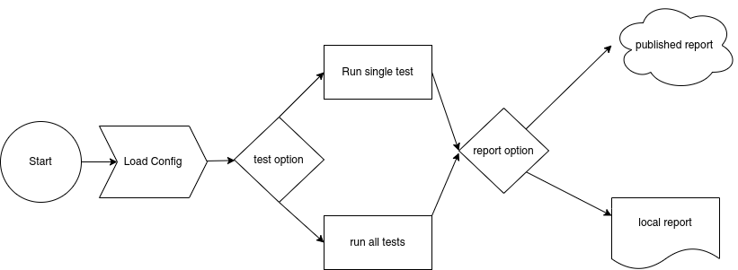

# Handshake Hero

## Overview

This application is designed to run as a dotnet tool, a stand alone CLI, docker container or a Kubernetes deployment. The purpose is to have a tool that can act as a client and validate connectivity between systems and report either locally or to a central collection service.

Driven by configuration this tool loads a yaml config of the tests that need to be performed.

## Development

## Contribution

